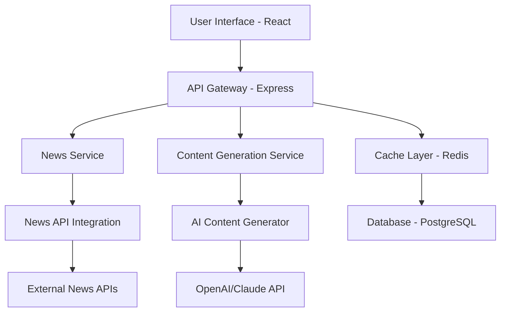

# Design Document

## Overview

The Company News Social App is a web-based application that integrates news aggregation APIs with AI-powered content generation to create a streamlined workflow for professionals to stay informed and share relevant business content on social media platforms.

The system follows a modern web architecture with a React frontend, Node.js/Express backend, and integrates with external news APIs and AI services for content processing and generation.

## Architecture

### High-Level Architecture



### System Components

1. **Frontend (React SPA)**
   - User interface for company search
   - News highlights display
   - Social media content presentation
   - Copy-to-clipboard functionality

2. **Backend API (Node.js/Express)**
   - RESTful API endpoints
   - Request validation and rate limiting
   - Business logic orchestration

3. **News Aggregation Service**
   - Integration with multiple news APIs (NewsAPI, Alpha Vantage, etc.)
   - Company name normalization and matching
   - Article filtering and relevance scoring

4. **Content Generation Service**
   - AI-powered highlight extraction
   - Platform-specific social media content generation
   - Hashtag suggestion and optimization

5. **Caching Layer**
   - Redis for API response caching
   - Reduces external API calls and improves performance

## Components and Interfaces

### Frontend Components

```typescript
// Main application component structure
interface AppState {
  searchQuery: string;
  newsData: NewsArticle[];
  socialContent: SocialMediaContent;
  loading: boolean;
  error: string | null;
}

interface NewsArticle {
  id: string;
  title: string;
  highlights: string[];
  sourceUrl: string;
  sourceName: string;
  publishedAt: Date;
}

interface SocialMediaContent {
  linkedin: SocialPost[];
  twitter: SocialPost[];
  facebook: SocialPost[];
  instagram: SocialPost[];
}

interface SocialPost {
  content: string;
  hashtags: string[];
  characterCount: number;
}
```

### Backend API Endpoints

```typescript
// API endpoint definitions
GET /api/news/:companyName
POST /api/content/generate
GET /api/health

// Request/Response interfaces
interface NewsRequest {
  companyName: string;
  limit?: number;
}

interface NewsResponse {
  articles: NewsArticle[];
  generatedContent: SocialMediaContent;
  cacheHit: boolean;
}
```

### External API Integrations

1. **News APIs**
   - Primary: NewsAPI.org for general news
   - Secondary: Alpha Vantage for financial news
   - Fallback: Google News RSS feeds

2. **AI Content Generation**
   - OpenAI GPT-4 for content generation
   - Fallback to Claude API for redundancy

## Data Models

### Database Schema

```sql
-- Companies table for caching and normalization
CREATE TABLE companies (
  id SERIAL PRIMARY KEY,
  name VARCHAR(255) NOT NULL,
  aliases TEXT[], -- Array of alternative names
  ticker_symbol VARCHAR(10),
  created_at TIMESTAMP DEFAULT NOW()
);

-- News articles cache
CREATE TABLE news_articles (
  id SERIAL PRIMARY KEY,
  company_id INTEGER REFERENCES companies(id),
  title TEXT NOT NULL,
  content TEXT,
  highlights TEXT[],
  source_url TEXT NOT NULL,
  source_name VARCHAR(255),
  published_at TIMESTAMP,
  fetched_at TIMESTAMP DEFAULT NOW(),
  INDEX(company_id, published_at)
);

-- Generated social content cache
CREATE TABLE social_content (
  id SERIAL PRIMARY KEY,
  article_id INTEGER REFERENCES news_articles(id),
  platform VARCHAR(50) NOT NULL,
  content TEXT NOT NULL,
  hashtags TEXT[],
  generated_at TIMESTAMP DEFAULT NOW()
);
```

### Data Flow

1. **User Input Processing**
   - Normalize company name
   - Check cache for recent results
   - Query external APIs if cache miss

2. **News Processing Pipeline**
   - Fetch articles from multiple sources
   - Filter for relevance and recency
   - Extract key highlights using AI
   - Store in database for caching

3. **Content Generation Pipeline**
   - Analyze news highlights
   - Generate platform-specific content
   - Optimize for character limits and engagement
   - Cache generated content

## Error Handling

### Error Categories

1. **User Input Errors**
   - Invalid company names
   - Empty search queries
   - Rate limit exceeded

2. **External API Errors**
   - News API failures
   - AI service unavailability
   - Network timeouts

3. **System Errors**
   - Database connection issues
   - Cache service failures
   - Internal server errors

### Error Response Strategy

```typescript
interface ErrorResponse {
  error: {
    code: string;
    message: string;
    details?: any;
  };
  fallback?: {
    data: any;
    source: string;
  };
}
```

### Fallback Mechanisms

- **News API Fallback**: Multiple news sources with priority ordering
- **AI Service Fallback**: Secondary AI provider for content generation
- **Cache Fallback**: Serve stale data with appropriate warnings
- **Graceful Degradation**: Basic functionality when services are unavailable

## Testing Strategy

### Unit Testing
- Component testing for React components
- Service layer testing for business logic
- API endpoint testing with mocked dependencies

### Integration Testing
- End-to-end API testing
- External service integration testing
- Database integration testing

### Performance Testing
- API response time benchmarking
- Concurrent user load testing
- Cache effectiveness measurement

### User Acceptance Testing
- Manual testing of user workflows
- Cross-browser compatibility testing
- Mobile responsiveness testing

## Security Considerations

1. **API Key Management**
   - Environment variable storage
   - Key rotation policies
   - Rate limiting per API key

2. **Input Validation**
   - SQL injection prevention
   - XSS protection
   - Input sanitization

3. **Data Privacy**
   - No personal data storage
   - GDPR compliance for EU users
   - Secure data transmission (HTTPS)

## Performance Optimization

1. **Caching Strategy**
   - Redis for API responses (TTL: 15 minutes)
   - Browser caching for static assets
   - CDN for global content delivery

2. **API Optimization**
   - Request batching where possible
   - Parallel API calls for multiple sources
   - Response compression

3. **Frontend Optimization**
   - Code splitting and lazy loading
   - Image optimization
   - Bundle size optimization